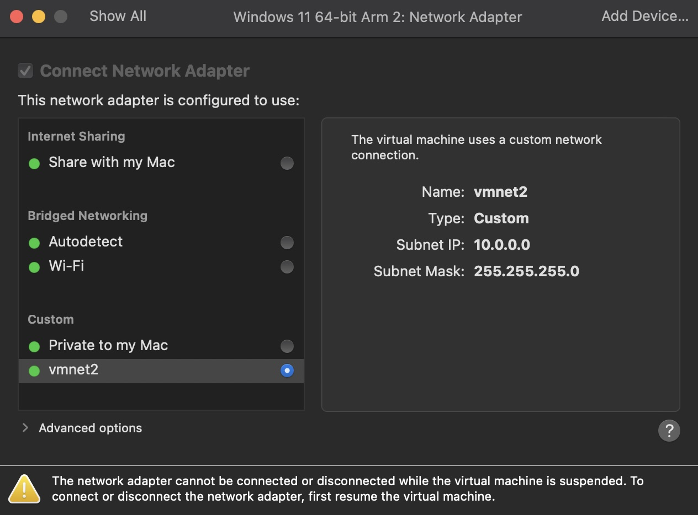

# Create VM instances
1. Download VMware Fusion Pro: https://knowledge.broadcom.com/external/article/368667/download-and-license-vmware-desktop-hype.html
- I learnt recently that VMware Workstation Pro is now also free for personal use. However, only Fusion supports MacOS, and specifically Silicon-chip Mac, so I am using Fusion Pro in this lab

2. Download ISOs for Windows Server 2025 and Ubuntu 25.10
- Windows Server 2025 arm64: https://uupdump.net/known.php?q=windows+server+arm64
- Ubuntu 25.10 Questing Quokka: https://cdimage.ubuntu.com/releases/questing/snapshot-1/
- UUPdump is a completely legal handy project that leverages UUP (Unified Update Platforms) files, which are publicly available on Microsoft's servers. Microsoft uses UUP to deliver feature updates to Windows users, and UUPdump retrieves these files to create an ISO from them
- Ubuntu 25.10 is one of the few versions of Ubuntu Desktop that supports ARM architecture. Other options are using Ubuntu 22.04 Desktop arm64, or converting Ubuntu 20.04 Server into Desktop, but I find Ubuntu 25.10 to be the easiest and most stable choice.

3. Create VM instances in VMware Fusion with downloaded ISOs
- I gave 4GB of RAM for and 64GB and 50GB of storage to Windows Server and Ubuntu respectively. I'd recommend the same amount of storage, while RAM should be adjusted according to your own machine's specs. Here, my machine has a total of 8GB.
- Choose the network you created in the previous step as networking option. Here, my network is "vmnet2"

4. Finish
