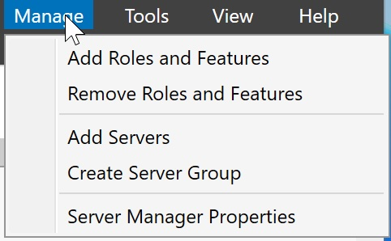
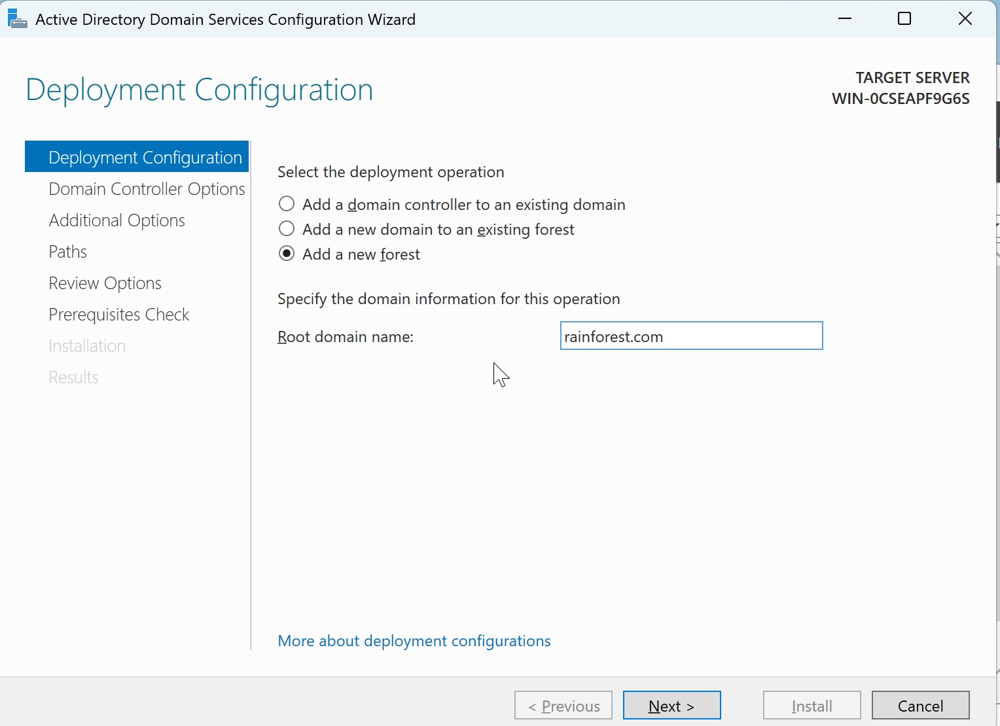
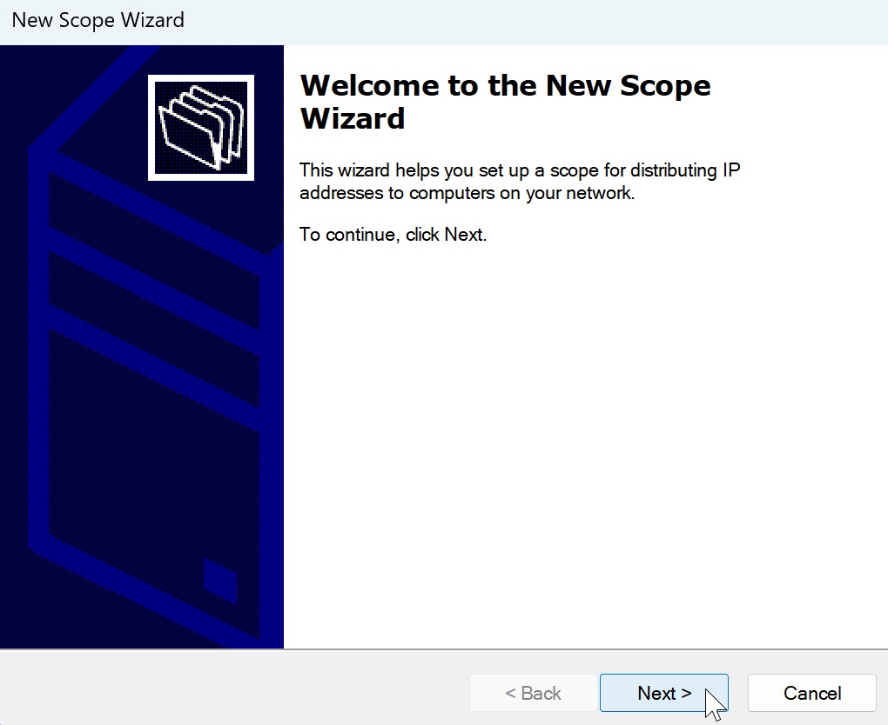
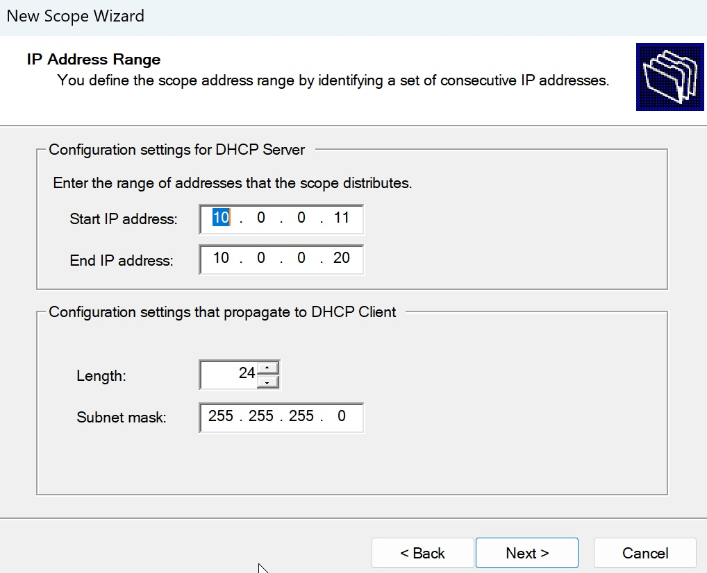
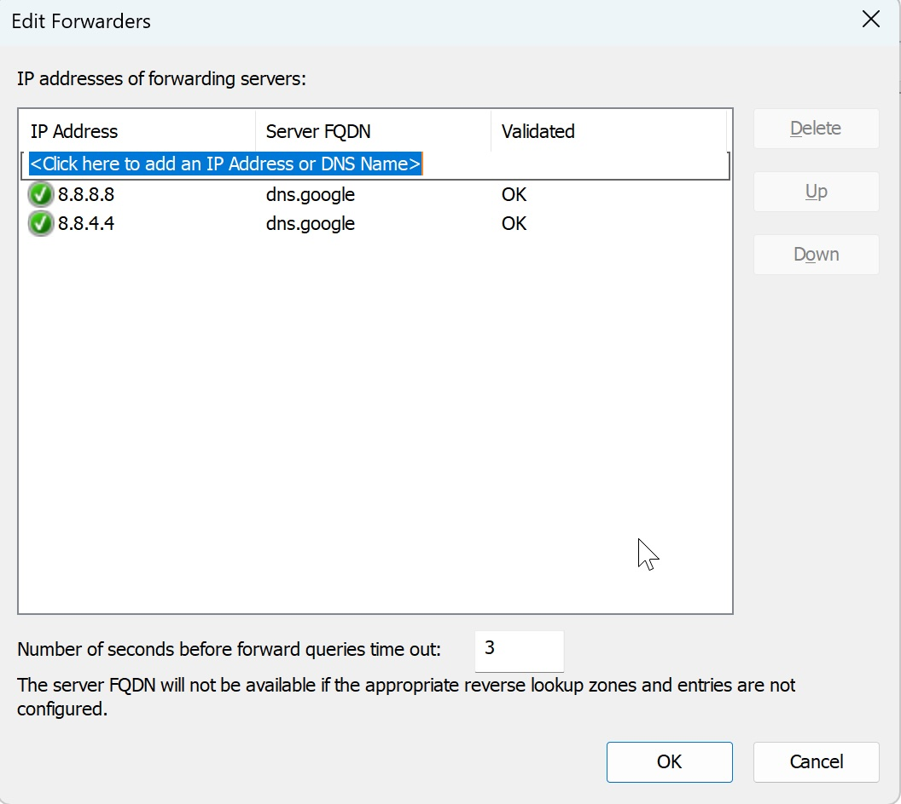

# Add and Configure features in Windows Server

## Add services
1. Set Static IP address
- Our server would need a static IP address to function as a DHCP server
- Go to *Settings*, then *Network & Internet*, select *Edit* next to IP assignment
- Flip the drop-down to *Manual*, switch on IPv4, then fill out the information with the IP configuration from "ipconfig" result in PowerShell
- Make sure the IP address and subnet mask is consistent with the IP configuration in Networking file that we modified in the previous step
- Example: Subnet 10.0.0.0 and Subnet Mask 255.255.255.0 -> IP address must be within 10.0.0.1 and 10.0.0.255
- Use NAT gateway address from nat.conf as default gateway. For me, it is 10.0.0.2
- In Preferred DNS, repeat the server's static IP address, since we are also using the Windows Server as a DNS Server
- Save to close the window

2. In Server Manager of Windows Server, select *Manage* then *Add Roles and Features*
- If Server Manager isn't already opened, you search for it from start menu


3. Select *Next* to go with the default options until *Server Roles*, select *Active Directory Domain Services*, *DHCP Server*, and *DNS Server*

4. Click *Next* and *Install* to install services onto the server. Select *Close* once the installation finishes.

## Promote Server to Domain Controller
A Domain Controller sits at the center of a domain and manages all members of the domain through Group Policy Objects (GPO). A Domain Controller is required when creating a domain.

1. In Server Manager, click on the flag icon at the top right of the window, then select *Promote this Server to a Domain Controller" to open Deployment Configuration window


2. In Deployment Configuration tab, select *Add a new forest* and enter root domain name.
- Root domain name should be in the format [domain].com, e.g: mydomain.com
- Select *Next*


3. In Domain Controller Options, select the highest functional level for both forest and domain, since we are creating a new forest. Enter Restore Mode password and make sure you remember the password. Select *Next*

4. In DNS options, if you see error message that says "A delegation for this DNS server cannot be created...", ignore if for now as we will configure our DNS server later. Click *Next*

5. In Additional Options, you can change the NetBIOS name, or use the default one. Click *Next*

6. In Paths, use default paths. Click *Next*

7. In Review Options, review the domain and forest names, then select *Next* and then *Install*

8. The system will then reboot. Login with Admin credentials. In Server Manager, you should see an option for ```AD DS``` on the right panel. Our domain is now set up.

## Configure DHCP service
DHCP service provisions IP addresses to members of the domain dynamically and make sures any machine joining the domain will automatically be assigned an IP address to communicate with other members of the domain

1. In Server Manager, select *Tools* then *DHCP*

2. In the left panel, under DHCP, expand the server, then right-click IPv4, select *New Scope* to start New Scope Wizard


3. In Scope Name, provide a scope name, then click *Next*

4. In IP Address Range, provide a range that is within the subnet configured in ```/Library/Preferences/VMware Fusion/networking``` file
- For me, the scope has to be within 10.0.0.1 and 10.0.0.255, so I used the range 10.0.0.11 -> 10.0.0.20
- Select *Next*


5. In Exclusions and Deplay, add any IP addresses within the range that you want to exclude from being provisioned to machines in the domain. Otherwise, leave it blank. Select *Next*

6. In Lease Duration, select any duration you want. For me, I chose to let the lease expire within 1 day.

7. In Configure DHCP Options, click on ```Yes, I want to configure these options now``` then *Next*

8. In Router (Default Gateway), add the NAT gateway address. This can be found in ```/Library/Preferences/VMware Fusion/vmnet2/nat.conf``` where ```vmnet2``` is the network I created for the domain.

9. In Domain Name and DNS Servers, add the Domain Controller's static IP if it has not already been added. Click *Next*

10. In Activate Scope, select to activate the scope, then *Next*

11. Select *Finish* to close the wizard

12. The IPv4 icon in the right panel of DHCP window should have a green check to signify that the scope is activated. If not, right-click on the scope under IPv4 and select *Activate*

## Configure DNS Server
DNS server is necessary for access the Internet, as it translates URL into IP addresses that routers can use to navigate. In a domain, DNS server can also allow access to private resources.
For now, since we don't have any private resources, we only need the DNS server for Internet access, so configuring forwarders should be enough.

1. In Server Manager, select *Tools* then *DNS*

2. In DNS Manager, right-click on the DNS server name and select *Properties*

3. Go to Forwarders tab and select *Edit*

4. Add addresses ```8.8.8.8``` and ```8.8.4.4```, which are well-known Google DNS servers. If you know any good public DNS server, feel free to add them as well. Select *OK* to close the window and close DNS Manager


5. Our DNS server will now forward DNS queries to the forwarder addresses, which will resolve URL to IP addresses for us. Verify that Internet access is available.   

## Create User account
1. In Server Manager, select *Tools* then *Activie Directory Users and Computers*

2. Under the domain name, right-click on *Users*, go to *New* -> User

3. In the newly opened window, fill in user's first and last name and logon name. Click *Next*

4. Enter the account password and select options for this password:
- User must change password at next logon
- User can not change password
- Password never expire
- Account is disabled
The options are self-explantory. For me, I only enable *Password never expire* for simplicity. Click *Next*

5. Review user account and finish.